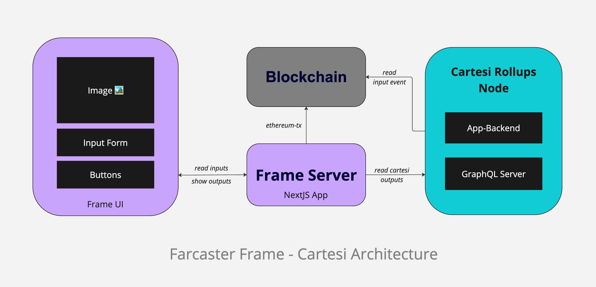

## Frames for Cartesi rollup dApps

Frames are tiny meta-apps within Farcaster client(like Warpcast). You can literally turn your post(aka cast) into an interactive app. Frames can work as UI for triggereing advance request on your Cartesi backend.

This project is a fork of https://github.com/Zizzamia/a-frame-in-100-lines


### How does it work?
There are multiple components to the architecture of this integration. Some notable ones that will be frequently used are:
- **Frame** - The frame is the UI that is rendered in the Farcaster client.
- **Frame Server** - The frame server is the server that is used to host the frame. It is the entry point for all frame requests including transaction requests, data validation, graphql queries and inspect request to the Cartesi node. It is a Next.js app leveraging Coinbase [OnchainKit](https://onchainkit.xyz) to handle frame requests.
- **Cartesi Node** - The Cartesi node is the backend that hosts your core application logic inside the Cartesi Machine. It has other components like the GraphQL server and Inspect server to read state of your dApp.

A high-level diagram of the architecture is shown below.



### Steps to run

> **Note:** Frames with transactions are best tested when deployed on a live server. Full fledged local debugging is currently not supported.

1. Clone this repo in your local machine
```
git clone https://github.com/Mugen-Builders/farcaster-frame-cartesi
```
2. Modify `config.ts` as per instructions in the file.

3. Create a `.env.local` file inside root directory with the following variable:
```
NEYNAR_API_KEY=<YOUR_NEYNAR_API_KEY>
```
4. Run the project
```
npm run dev
```
5. Create a ngrok server to test the frame on your local machine. Install ngrok from [here](https://ngrok.com/download).
```
ngrok http http://localhost:3000 
```
6. Add the ngrok generated server url to config.ts file.

7. Test the frame on [Warpcast frames validator](https://warpcast.com/~/developers/frames). Enter the ngrok url and you'll see the frame in action.

8. The frame is interacting with [to-upper](https://github.com/Mugen-Builders/to-upper-js) Cartesi backend example. If you want to interact with a different Cartesi dApp, make sure it is deployed on a testnet/mainnet and update variables in `config.ts` file accordingly.